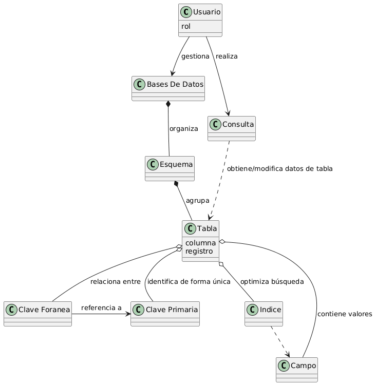
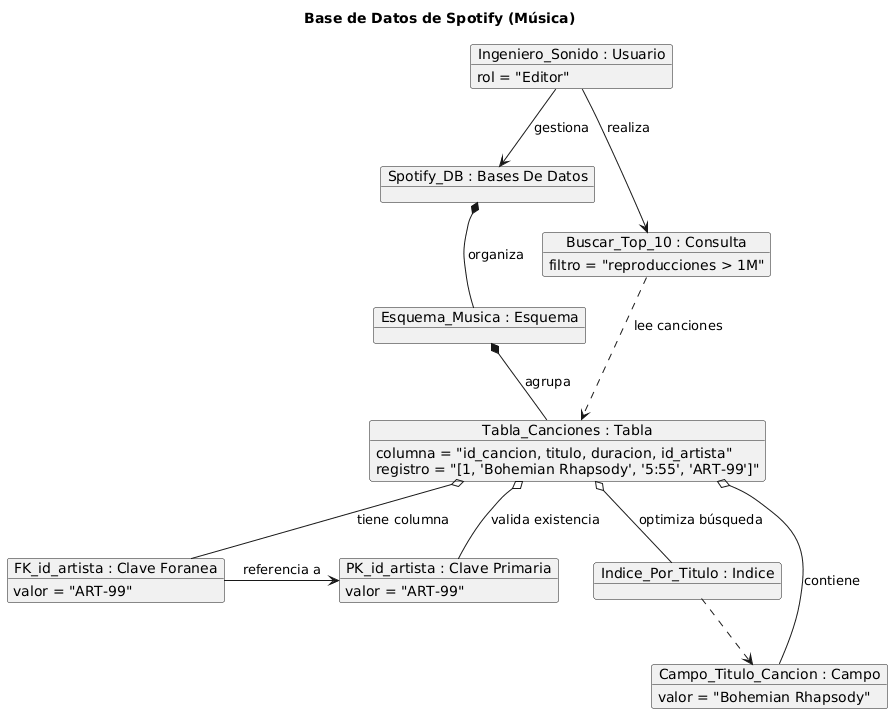
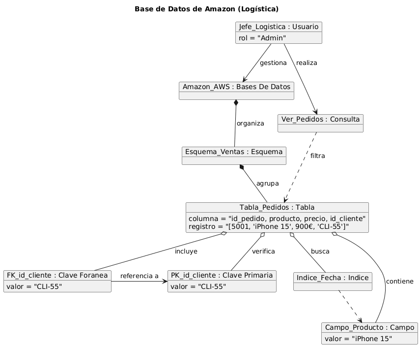

# Modelo de Dominio

## Diagrama de Clases 
| Diagrama | Código Fuente |
|----------|---------------|
| | [Ver código](./src/diagramaClases/diagramaClases.puml) |

> **Nota sobre FK y PK:** Como corregí en la segunda parte del examen, he creado la relación entre Clave Primaria y Clave Foranea. Esta relación es de Dependencia (`---→`) porque la FK utiliza la PK para referenciar datos. No es herencia ni composición, simplemente una referencia.

## Diagramas de Objetos 
| Diagrama | Código Fuente |
|----------|---------------|
| | [Ver código](./src/diagramaObjetos/primerDiagramaObjetos/primerDiagramaObjetos.puml) |
| | [Ver código](./src/diagramaObjetos/segundoDiagramaObjetos/segundoDiagramaObjetos.puml) |